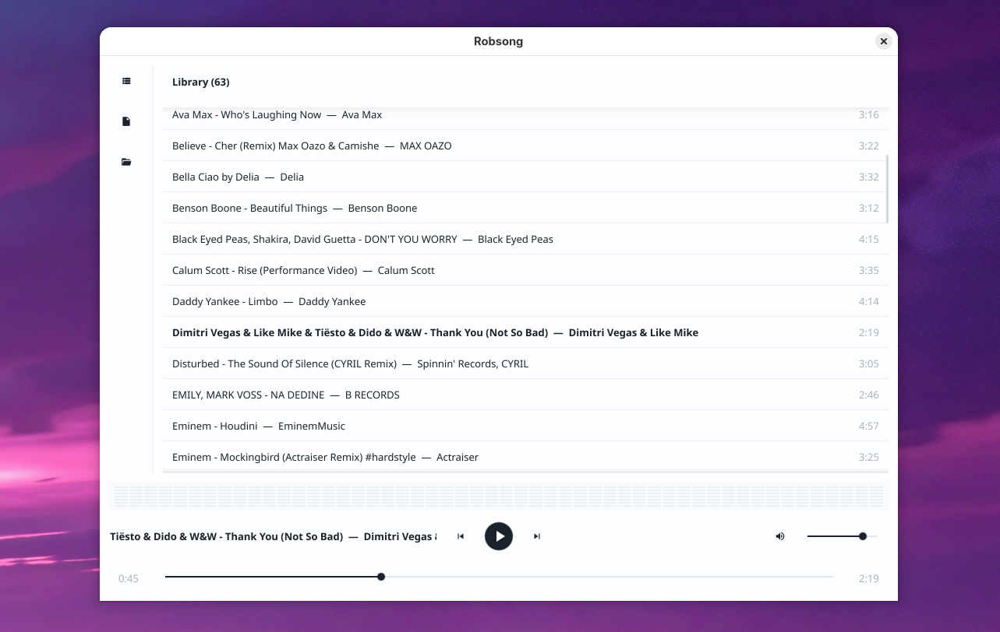

<p align="center">
  
</p>

<h1 align="center">Robsong</h1>

<p align="center">
  A lightweight desktop music player for local files, built with <a href="https://fyne.io/">Fyne</a> and Go.
</p>

<p align="center">
  
  
  
</p>

## Features

- Play local audio: **MP3**, **FLAC**, **WAV**, **OGG (Vorbis)**
- Library and user playlists stored in **SQLite** (`~/.config/robsong/library.db`)
- Import individual files or entire folders
- Double-click to play from a track; drag to reorder (persisted)
- Context menu: play, add to playlist, delete from playlist
- Bottom bar with spectrum visualizer, seek, and volume
- Clean light theme

<p align="center">
  
</p>

## Install

Prebuilt Linux (amd64) packages are on
[GitHub Releases](https://github.com/rdurica/robsong/releases/latest):

| Artifact | Install |
|----------|---------|
| Binary | Download, `chmod +x`, run `./robsong-*-linux-amd64` |
| Tarball | `sudo tar -C / -xzf robsong-*-linux-amd64.tar.gz` |
| RPM | `sudo dnf install ./robsong-*.x86_64.rpm` |
| DEB | `sudo apt install ./robsong_*_amd64.deb` |

Audio codecs ship inside the binary (no ffmpeg). Packages declare only common desktop libraries (OpenGL, X11/Wayland, ALSA). User data stays in `~/.config/robsong/`.

## Requirements (Fedora)

Install system dependencies (or run `make deps`):

```bash
sudo dnf install -y \
  golang gcc \
  libX11-devel libXcursor-devel libXrandr-devel \
  libXinerama-devel libXi-devel libXxf86vm-devel \
  libglvnd-devel alsa-lib-devel wayland-devel libxkbcommon-devel
```

This project needs **CGO** (Fyne / OpenGL / ALSA). Without `libXxf86vm-devel`, the linker may report `cannot find -lXxf86vm`; the Makefile works around that with a local stub in `.link/`.

## Build & run

```bash
make run
```

Or build then launch:

```bash
make build
./robsong
```

Run checks locally (same as CI):

```bash
make test
```

The **first build** after a clean clone (or `go clean -cache`) can take **1–2 minutes** while CGO compiles Fyne/OpenGL. Later builds are much faster.

## Distribution (Linux)

Build release artifacts (stripped binary, tarball, RPM, DEB):

```bash
make package
```

Or individually:

```bash
make release   # dist/robsong
make tarball   # dist/robsong-<ver>-linux-amd64.tar.gz
make rpm       # dist/robsong-<ver>.x86_64.rpm  (needs nfpm)
make deb       # dist/robsong_<ver>_amd64.deb   (needs nfpm)
```

Install `nfpm` once for RPM/DEB builds:

```bash
go install github.com/goreleaser/nfpm/v2/cmd/nfpm@latest
```

Prebuilt packages are published on [GitHub Releases](https://github.com/rdurica/robsong/releases/latest) when a version tag (e.g. `0.1.0`) matching `FyneApp.toml` is pushed. See [Install](#install) for how to use them.

## Usage

1. **Import files** / **Import folder** — adds supported tracks to Library (and to the current playlist if one is selected).
2. **Double-click** a track to play it and continue with the following tracks.
3. **Drag** tracks to change order in the playlist (saved to SQLite).
4. Use the bottom bar for previous / play-pause / next, seek, and volume.
5. **New** in the sidebar creates a playlist; **Add to playlist…** adds the selected track.

OGG support is **Vorbis only** (not Opus).

## Project layout

```
cmd/robsong/          application entry point
assets/               logo, screenshot, and embedded app icon
packaging/            .desktop entry and release notes
nfpm.yaml             RPM/DEB package metadata (nFPM)
internal/
  audio/              playback (beep) and FFT analyzer
  library/            import and metadata (dhowden/tag)
  model/              Track, Playlist
  playlist/           SQLite store
  queue/              in-memory playback queue
  theme/              Fyne theme
  ui/                 layout and wiring
```
